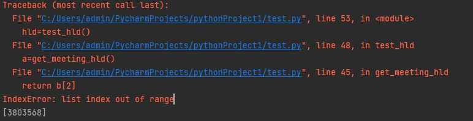

# 本项目现已废除，仅供学习和参考
# 腾讯会议自动签到

#### 介绍
腾讯会议自动签到

腾讯会议需要v3.10.8(405)版本以上

使用脚本时不要有任何的置顶窗口


```
pip install keyboard
pip install pywin32
```


使用教程：
1.打开腾讯会议
2.进入会议
3.打开会议应用中的签到
4.运行脚本


这样就是运行成功


！！！报错！！！
如果遇到以下报错





请关掉签到的窗口重新打开！！！


运行成功后将腾讯会议以及脚本放后台即可

切记！！！请不要关掉签到窗口
